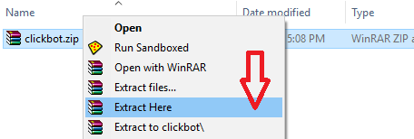
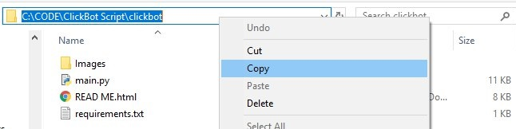

# ClickBot script by [Ziziworks](https://www.youtube.com/channel/UCW36UNroi3B4Ix9ln1e6rUQ?sub_confirmation=1)
[Youtube](https://www.youtube.com/channel/UCW36UNroi3B4Ix9ln1e6rUQ?sub_confirmation=1) |
[Instagram](https://www.instagram.com/ziziworks/) |
[Facebook](https://www.facebook.com/ziziworks/) |
[Telegram Channel](https://t.me/ziziworks) |
[Telegram Group](https://t.me/ziziworksgroup) |
[Twitter](https://twitter.com/ziziworks_MY)  
A script written on Python for automated telegram crypto earning bot.  
It can be used for earning various type of cryptocurrency.  
This script can be run on Window's command prompt
and Termux terminal on Android.
## Overview
ClickBot is a bot was made by [DOGE Click](https://dogeclick.com/) , a pay to click service that uses cryptocurrency to process payments..    
    
### Features:
- [x] Usable to earn Bitcoin, Dogecoin, Litecoin, Bitcoin Cash and ZCash.
- [x] 3 functions such as visiting sites, joining chats, and messaging bots.
- [x] User determine which cryptocurrency to earn.
- [x] User determine which funtions to use.
- [ ] AutoComplete captcha (skip captcha for now)
- [ ] Earn multiple cryptocurrency simultaneously

Host with python
ClickBot script builds completely with python that you can host on python terminal in Windows, MacOS, Linux
or anywhere else you choose which support python environment.

3 in 1 script
Scripts have 3 action functions that visit the site, join chat, and message bots. Great of all, users can choose which one you want to use.

Easy to Use
Get your cryptocurrency with our script is super easy. We do all your job.

With only a few simple command and its done
## Download
Script is where the magic begins. Go ahead and download it now.    
If you don't download the script yet get it now by clicking [/releases](/releases/latest)
## Intallation
### Install Python on Windows
Watch video tutorial :    
[](https://www.youtube.com/watch?v=-lmO-_W8-Jw)
Download [Python](https://www.python.org/downloads/) for Windows    
    
When you're installing python made sure you checked "Add Python 3.7 to PATH"    
`../your_path/` mean path/directory/location to your clickbot file.    
### Extract
    
Extract the ClickBot package using [WinRAR](https://www.rarlab.com/)    
Extract the ClickBot by right click on the ClickBot.zip then click on Extract Here    
## Where is your file?
    
It is important to know, where is your file directory path because we need this for the next step.    
As stated in the picture above, my ClickBot file is located at `C:\CODE\ClickBot Script\clickbot`
## Installing required modules
If you notice we have provided a file named **requirements.txt**, there are all the required modules.    
It has been listed in the file.    
To install all these modules, you need to run the following command to install it:    
```
pip install -r C:\CODE\ClickBot Script\clickbot\requirements.txt
```
### Install Python on Termux
Download [Termux](https://play.google.com/store/apps/details?id=com.termux&hl=en) from Playstore 
`../your_path/` mean path/directory/location to your TeleInviter file.
Open termux enter commands below:  
`pkg update && pkg upgrade`  
`pkg install python git`  
`cd ../your_path/`  
`pip install -r requirements.txt`  
#### Example:
`cd /storage/emulated/0/TeleInviter`  
`pip install -r requirements.txt`
## Configuration
### Config.ini
Config.ini consist setting for the script.
You can edit it using any text editor such as Notepad
You can obtain your API ID at https://core.telegram.org/api/obtaining_api_id
```
[SETTING]` -------------------------------- _don't change this_  
invite_interval = 35` --------------- _Invite a username every 35 seconds_  
pax_size = 50` ------------------------- _Invite 50 username before a rest_  
pax_rest = 300` ----------------------- _Rest for 300 seconds, Set 0 for no rest_  
flood_rest = 1200` ------------------ _If one's account got flood error from telegram. Rest for 1200 seconds._  
target_group = ziziworks` ------- _Invite to what group? Specify the group ID_  
api_id = ` ------------------------------ _Telegram's application API ID_  
api_hash = ` -------------------------- _Telegram's application API Hash_  
```
### Username file
Username file consist a list of username used for inviting  
Username file can be either **.txt*or **.csv**
Script read username, line by line
## Run the clickbot
You can just double click on **start.py*and it will ask any requirements later such as phone number and username_file.
You can also run it by specifying required arguments as example below.
Input number in international format (example: +60123456789)
Username file can be either **.txt*or **.csv* 

`../your_path/` mean path/directory/location to your TeleInviter file._
###  Windows
Open cmd (command prompt)
Enter following command :
`python ../your_path/start.py +123456789 username.txt`
#### Example:
 `python D:\TeleInvite\start.py +123456789 username.txt`
### Termux
Enter following command :
`cd ../your_path/`  
`python ../your_path/start.py +123456789 username.txt`
#### Example:
 `python D:\TeleInvite\start.py +123456789 username.txt`
## Help! Bugs ? Recommendation?

If there any bug, please report to [Zizi](http://t.me/ziziwho)
