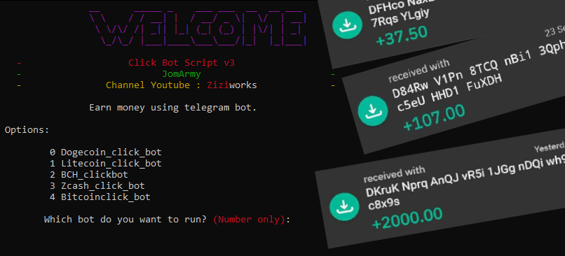

# ClickBot script by [Ziziworks](https://www.youtube.com/channel/UCW36UNroi3B4Ix9ln1e6rUQ?sub_confirmation=1)

[Youtube](https://www.youtube.com/channel/UCW36UNroi3B4Ix9ln1e6rUQ?sub_confirmation=1) |
[Instagram](https://www.instagram.com/ziziworks/) |
[Facebook](https://www.facebook.com/ziziworks/) |
[Telegram Channel](https://t.me/ziziworks) |
[Telegram Group](https://t.me/ziziworksgroup) |
[Twitter](https://twitter.com/ziziworks_MY)  

[](https://forthebadge.com)    [](https://forthebadge.com)

A script written on Python for automated telegram crypto earning bot.  
It can be used for earning various type of cryptocurrency.  
This script can be run on Window's command prompt
and Termux terminal on Android.

## Overview
ClickBot is a bot was made by [DOGE Click](https://dogeclick.com/) , a pay to click service that uses cryptocurrency to process payments..    

    
### Features:
- [x] Usable to earn Bitcoin, Dogecoin, Litecoin, Bitcoin Cash and ZCash.
- [x] 3 functions such as visiting sites, joining chats, and messaging bots.
- [x] User determine which cryptocurrency to earn.
- [x] User determine which funtions to use.
- [ ] AutoComplete captcha (skip captcha for now)
- [ ] Earn multiple cryptocurrency simultaneously
## Download
Script is where the magic begins. Go ahead and download it now.    
If you don't download the script yet get it now by clicking [/releases](/releases/latest)
## Intallation
### For Windows

Read text tutorial at [/Installation/Windows](/Installation/Windows/Install_windows.md)    

Watch video tutorial :    

[](https://www.youtube.com/watch?v=-lmO-_W8-Jw)    

### For Android

Read text tutorial at [/Installation/Android](/Installation/Android/Install_android.md)    

Watch video tutorial :    

[](https://www.youtube.com/watch?v=9z4meV0BMMQ)    

##### Usage: 
> python main.py phone_number [optional for notes]    

❗ Input number in international format (example: +1234567890)    

Open your windows command prompt or termux terminal. Type the following command:    

> **Windows@Command-Prompt :**    
> ```
> python C:\CODE\ClickBot Script\clickbot\main.py +1234567890
> ```
> **Android@Termux :**    
> ```
> python /storage/emulated/0/clickbot/main.py +1234567890
> ```
⚠️ Attention! Make sure you enter your phone number which linked with telegram.
## Bugs and Issues

Have a bug or an issue with this script? [Open a new issue](https://github.com/ziziwho/clickbot/issues/new) here on GitHub or leave a message on my [telegram](http://t.me/ziziwho).


---

> **Disclaimer**<a name="disclaimer" />: Please be note that this is a learning project for me. I am by no means responsible for any usage of this tool. Use on your own behalf. I'm also not responsible if your accounts get any punishment due to extensive use of this script. Your Telegram account may get banned therefore, I am not responsible for any improper use of this bot. This bot is intended for the purpose of automating Click Bot, as well as efficiently managing bot command. You ended up spamming groups join, telegram request getting reported left and right, and you ended up in a Finale Battle with Telegram and at the end. Telegram Team deleted your account?
And after that, then you pointed your fingers at us, for getting your account deleted? I will rolling on the floor laughing at you.
