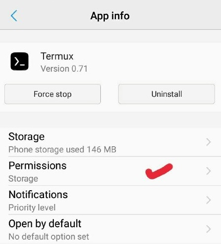
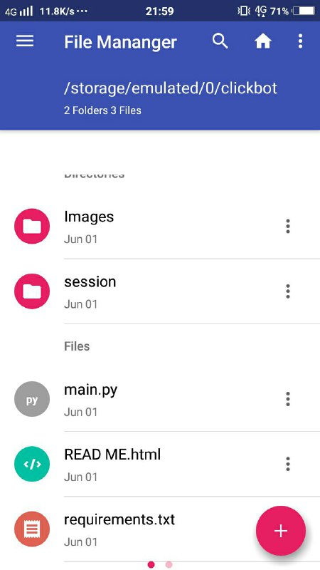

# ClickBot script by [Ziziworks](https://www.youtube.com/channel/UCW36UNroi3B4Ix9ln1e6rUQ?sub_confirmation=1)
[](https://forthebadge.com)    [](https://forthebadge.com)

[Youtube](https://www.youtube.com/channel/UCW36UNroi3B4Ix9ln1e6rUQ?sub_confirmation=1) |
[Instagram](https://www.instagram.com/ziziworks/) |
[Facebook](https://www.facebook.com/ziziworks/) |
[Telegram Channel](https://t.me/ziziworks) |
[Telegram Group](https://t.me/ziziworksgroup) |
[Twitter](https://twitter.com/ziziworks_MY)  
A script written on Python for automated telegram crypto earning bot.  
It can be used for earning various type of cryptocurrency.  
This script can be run on Window's command prompt
and Termux terminal on Android.
### Table of Contents
- **[Settings](#Overview)**
  - [Liking](#liking)
## Overview
ClickBot is a bot was made by [DOGE Click](https://dogeclick.com/) , a pay to click service that uses cryptocurrency to process payments..    

    
### Features:
- [x] Usable to earn Bitcoin, Dogecoin, Litecoin, Bitcoin Cash and ZCash.
- [x] 3 functions such as visiting sites, joining chats, and messaging bots.
- [x] User determine which cryptocurrency to earn.
- [x] User determine which funtions to use.
- [ ] AutoComplete captcha (skip captcha for now)
- [ ] Earn multiple cryptocurrency simultaneously
## Download
Script is where the magic begins. Go ahead and download it now.    
If you don't download the script yet get it now by clicking [/releases](/releases/latest)
## Intallation
### For Windows
Watch video tutorial :    

[](https://www.youtube.com/watch?v=-lmO-_W8-Jw)    

#### Download Python
Download [Python](https://www.python.org/downloads/) for Windows    
    
When you're installing python made sure you checked "Add Python 3.7 to PATH"    
`../your_path/` mean path/directory/location to your clickbot file.    
#### Extract files
    
Extract the ClickBot package using [WinRAR](https://www.rarlab.com/)    
Extract the ClickBot by right click on the ClickBot.zip then click on Extract Here    
#### Where is your file?
    
It is important to know, where is your file directory path because we need this for the next step.       
As stated in the picture above, my ClickBot file is located at `C:\CODE\ClickBot Script\clickbot`
#### Installing required modules
If you notice we have provided a file named **requirements.txt**, there are all the required modules.    
It has been listed in the file.    
To install all these modules, you need to run the following command to install it:    
```
pip install -r C:\CODE\ClickBot Script\clickbot\requirements.txt
```
### For Android
Watch video tutorial :    

[](https://www.youtube.com/watch?v=9z4meV0BMMQ)    

#### Installing Termux
[Termux](https://termux.com/) is an Android terminal emulator and Linux environment app that works directly with no rooting or setup required.    
A minimal base system is installed automatically - additional packages are available using the APT package manager.    
Download and install [Termux from Playstore](https://play.google.com/store/apps/details?id=com.termux) on your android device.    

It is necessary to grant storage permission for Termux on Android 6 and higher. Use 'Settings>Apps>Termux>Permissions>Storage' and set to true.    
    
Execute termux-setup-storage (run apt update && apt upgrade to make sure that this tool is available) to ensure:    
That permission to shared storage is granted to Termux when running on Android 6.0 or later,    
That an app-private folder on external storage is created (if external storage exists),    
That a folder $HOME/storage is created.    
The contents of the created $HOME/storage folder are symlinks to different storage folders
#### Extract files
Extract the ClickBot package into a folder.    
You must make sure that ClickBot folder is located in Internal Storage not External Storage.    
#### Starting Termux
Start or Open your Termux application.    
Recall your file with cd command, which mean change directory



In my case, I placed my folder at /storage/emulated/0/clickbot

For changing command directory to your script folder location, you need to run the following command to install it:
cd /storage/emulated/0/clickbot


For updating latest termux package, you need to run the following command:

pkg update && pkg upgrade
For for installing python in your termux, you need to run the following command:
pkg install python git
If you notice we have provided a file named requirements.txt, there are all the required modules. It has been listed in the file.
To install all these modules, you need to run the following command to install it:

pip install -r requirements.txt

## Help! Bugs ? Recommendation?

If there any bug, please report to [Zizi](http://t.me/ziziwho)
